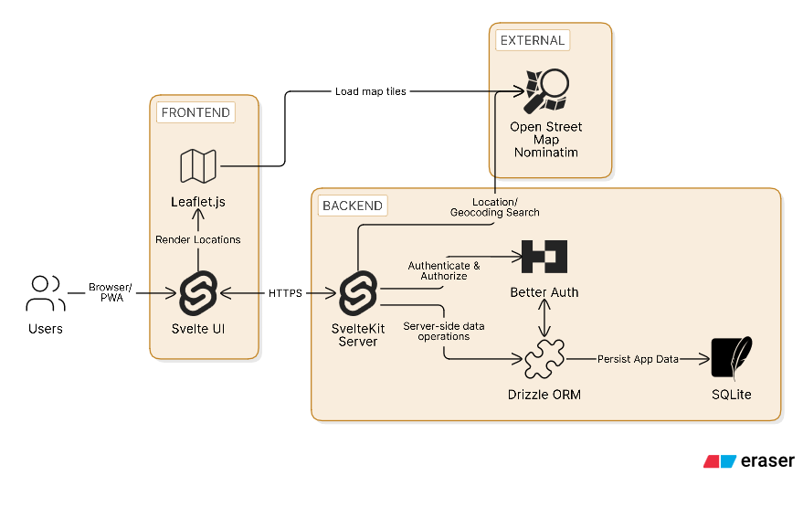
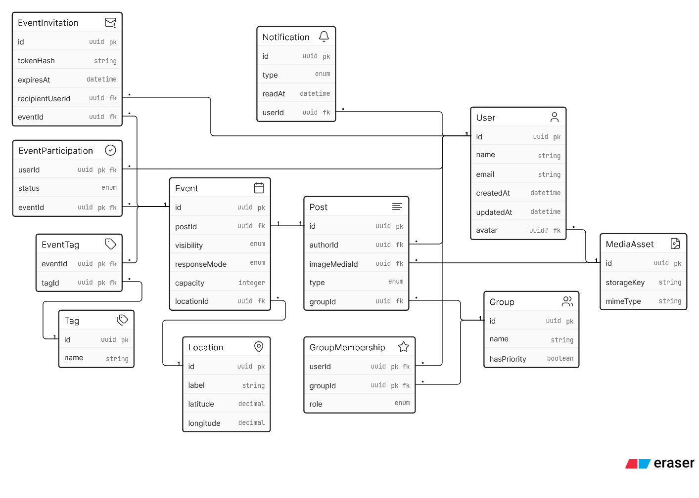

# Campus Connect — Phase 1: Conceptual Design Specification

This document is the Markdown version of the Phase 1 conception presentation. It records the agreed product scope and technical design that guide Phase 2 development.

## 1. Problem and vision

Campus life is active, but discovery is fragmented. Event information, hobby groups, and informal activities are spread across group chats, social media, and personal networks. This limits organiser visibility and makes it harder for students and teachers to find relevant ways to participate.

++**Campus Connect**++ is an unofficial, student-led application for IU Campus Bad Honnef. It centralises campus activities in an event-first feed with hobby tags, groups, and location information, making it easier to plan, discover, participate, and belong to the community.

The application provides:

- one central feed for campus activities;
- relevant interest tagging; and
- accessible use across desktop, tablet, and mobile devices.

## 2. Users and benefits

**Creators:** Student societies, campus venues, teachers, and proactive students can publish events, share group updates, and reach a wider audience.

**Explorers:** Students and teachers can discover relevant activities, follow groups, receive updates, and register interest or attendance with minimal effort.

**Shared value:** Campus Connect increases organiser visibility while making community participation easy, relevant, and inclusive. Creators and explorers strengthen one shared campus community.

## 3. Concept and MVP scope

The focused MVP supports discovery, connection, and participation.

**Accounts and profiles:** Users register and sign in with email and password. Each profile contains a display name and an optional avatar.

**Groups and posts:** Users can create groups. A group owner assigns representatives; subscribers follow group posts and events. A seeded **Campus Updates** group is visible to every account.

**Events and discovery:** Users can create personal or group events with a title, description, hobby tags, date/time, visibility, response mode, and location. The event feed supports filtering by tags, date, group, and event type.

**Participation and access control:** Events support announcements, interest sign-ups, or limited-capacity registration. Visibility can be public, subscriber-only, or invite-only. Invite-only events use direct in-app invitations or revocable share links.

**Notifications, locations, and media:** The system stores in-app notifications for group content and event changes. Events show a Leaflet map marker. Users, groups, and posts support image uploads.

### Constraints and exclusions

- The product is a responsive browser application for desktop, tablet, and mobile.
- The backend performs validation and authorization for every action.
- Structured data is stored in SQLite; media is stored externally.
- Geocoding is performed only through the backend.
- The MVP excludes comments, direct messages, payments, email invitations, video uploads, calendar synchronisation, and real-time push notifications.

## 4. Technical architecture

Campus Connect uses a server-centred architecture to protect data and control integrations.

- **Frontend:** Svelte 5, TypeScript, Tailwind CSS, and shadcn-svelte
- **Backend:** SvelteKit, Better Auth, Drizzle ORM, and SQLite
- **Maps:** Leaflet in the browser, displaying OpenStreetMap tiles
- **Geocoding:** Nominatim, called by the SvelteKit backend only after an explicit user search
- **Tooling:** Bun manages the environment and dependencies
- **Deployment:** Railway

The selected technologies are lightweight and support rapid, type-safe development, quick prototyping, responsive performance, and straightforward scaling.

## 5. Data model and business rules

The relational model separates feed content, event-specific information, group permissions, and participation records. This keeps the application extensible while enforcing MVP rules.

- **Posts and events:** Every event links to exactly one feed post. Standard group updates remain posts without an event record.
- **Group permissions:** `GroupMembership` roles — `owner`, `representative`, and `subscriber` — govern access. Only owners and representatives manage group posts and events.
- **Participation:** `EventParticipation` tracks interest or registration with one unique user/event pair and validates capacity to prevent duplicate registrations.
- **Event access:** `EventInvitation` supports named in-app recipients or hashed, revocable tokens for private events.
- **Locations and tags:** `Location` stores display labels and coordinates. `EventTag` provides a normalised many-to-many relation for filtering.
- **Media:** `MediaAsset` stores file metadata and storage keys, referencing externally stored assets instead of image data in SQLite.

## Implementation commitments

Phase 2 will deliver a responsive frontend connected to a developed backend, including multiple JavaScript-driven frontend/backend interactions. Examples include filtered event retrieval, creation and editing, following groups, RSVP/capacity changes, and marking notifications as read.

External API data must pass through the backend before reaching the frontend; this applies to Nominatim. The development phase also requires GitHub evidence, screenshots, a 1–2 minute desktop/responsive screencast, documented design changes, and test cases.
